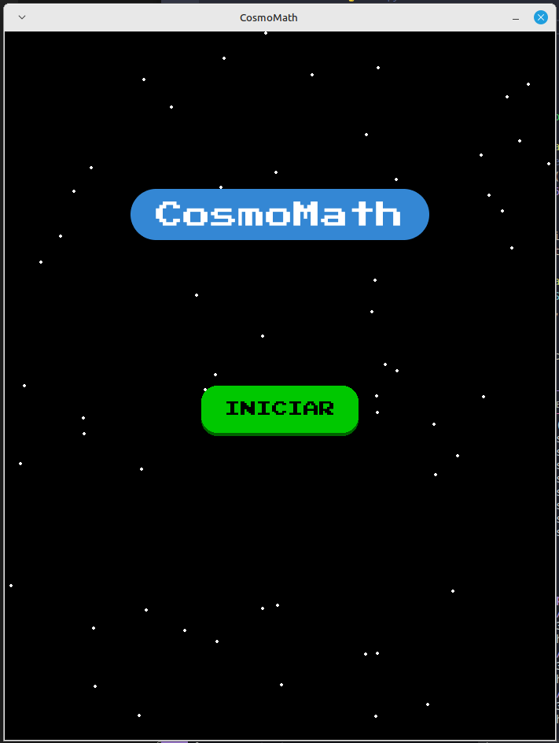
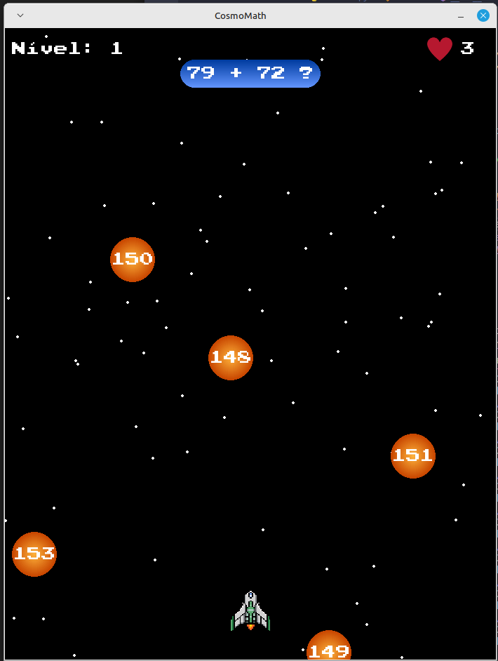
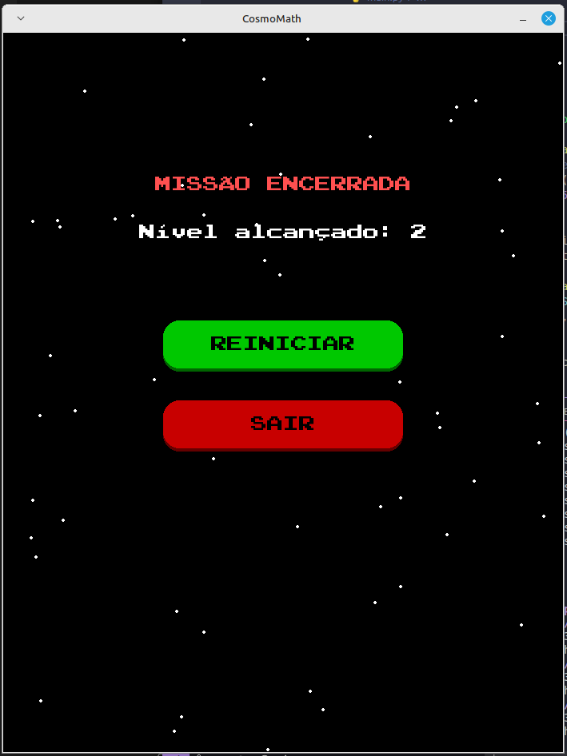

# 🚀 CosmoMath

**CosmoMath** é um jogo educativo desenvolvido em Python com a biblioteca [Pygame](https://www.pygame.org/).  
Seu objetivo é ajudar crianças (e adultos!) a praticarem contas de matemática básica de forma divertida, controlando uma nave espacial no espaço sideral!

---

## 🎮 Sobre o Jogo

Neste jogo, o jogador:
- Controla uma nave espacial com as teclas **←** e **→**
- Deve atirar com a tecla **espaço** nos números que **resolvem corretamente** a conta exibida no topo da tela
- Perde vidas se acertar a resposta errada ou deixar a resposta correta escapar

O jogo possui **níveis progressivos** com **operações de adição, subtração e multiplicação**.

---

## 🖼️ Imagens do Jogo

  
  

---

## ⚙️ Requisitos

Para rodar o CosmoMath, você precisa ter:

- Python instalado
- Pygame instalado 

